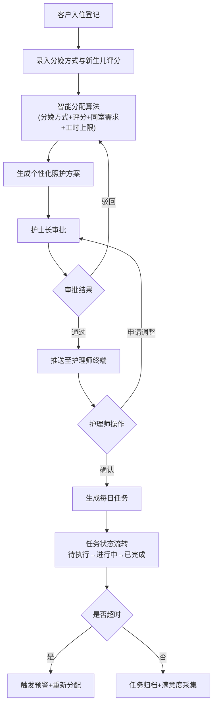

## 1. 产品概述
母婴护理中心智慧运营桌面系统是一套面向高端月子会所的综合运营管理平台，通过实时数据汇聚、智能算法分配和可视化监控，实现客户全生命周期管理、护理资源优化配置和运营决策支持。
- 解决传统护理中心运营中信息孤岛、资源分配不均、任务追溯困难等痛点
- 目标用户：护理中心管理人员、护士长、护理师、营养师、后勤人员
- 产品价值：提升照护质量、优化运营效率、降低管理成本、增强客户满意度

## 2. 核心功能

### 2.1 用户角色
| 角色 | 注册方式 | 核心权限 |
|------|----------|----------|
| 系统管理员 | 后台创建 | 全模块管理、用户权限、系统配置 |
| 护士长 | 后台创建 | 护理方案审批、任务监控、排班管理、预警处理 |
| 护理师 | 后台创建 | 任务确认/调整、照护执行、健康档案查看、工时记录 |
| 营养师 | 后台创建 | 营养餐配置、库存管理、忌口设置、饮食计划 |
| 后勤工程师 | 后台创建 | 设备维保、备件管理、工单处理 |

### 2.2 功能模块
1. **运营仪表盘**：核心KPI概览、今日任务统计、楼层热力图、预警通知中心
2. **客户管理**：入住登记、母婴健康档案、分娩方式录入、新生儿评分
3. **护理方案管理**：智能方案分配、方案审批流程、方案调整申请、母婴同室配置
4. **任务中心**：每日照护任务列表、状态流转（待执行/进行中/已完成）、超时预警、重新分配
5. **排班管理**：护理师排班日历、工时上限管控、班次交接记录
6. **营养餐管理**：阶段饮食计划、自动配餐、忌口管理、原材料库存、低库存预警
7. **设备管理**：设备台账、使用次数统计、维保工单、备件库存
8. **统计报表**：入住率统计、满意度分析、多维度筛选、PDF月度报告导出
9. **楼层可视化**：平面图展示、房间状态实时显示、护理师忙闲热力分布

### 2.3 页面详情
| 页面名称 | 模块名称 | 功能描述 |
|----------|----------|----------|
| 运营仪表盘 | KPI卡片组 | 实时入住率、在住客户数、今日任务完成率、库存预警数、待审批方案数 |
| 运营仪表盘 | 楼层热力图 | SVG楼层平面图，房间颜色区分占用状态，护理师位置以热力点叠加显示 |
| 运营仪表盘 | 预警通知栏 | 超时任务、低库存、待审批方案滚动展示，支持快捷跳转 |
| 客户管理 | 入住登记表单 | 客户基本信息、房型选择、入住日期、母婴同室勾选、分娩方式、新生儿Apgar评分录入 |
| 客户管理 | 健康档案列表 | 母亲健康指标（血压、血糖、伤口恢复）、新生儿生长曲线、疫苗记录 |
| 护理方案管理 | 智能分配面板 | 展示系统推荐方案，基于分娩方式+评分+同室需求+工时综合算法生成 |
| 护理方案管理 | 审批工作台 | 护士长审批列表，支持通过/驳回/调整，审批历史记录 |
| 任务中心 | 任务看板 | 按护理师分组的Kanban视图，拖拽切换状态，超时红色高亮 |
| 排班管理 | 周排班日历 | 网格状排班，颜色区分班次，超出工时显示红色边框 |
| 营养餐管理 | 配餐日历 | 按阶段（产后1-7天/8-14天/15-30天）显示三餐三点，忌口标记 |
| 营养餐管理 | 库存看板 | 原材料列表、当前库存、安全库存、低于安全库存黄色/红色预警 |
| 设备管理 | 维保工单 | 工单列表、设备使用次数触发规则、备件扣减记录 |
| 统计报表 | 多维度图表 | 按时段/房型柱状图、满意度雷达图、趋势折线图 |
| 统计报表 | 报告导出 | 一键生成月度PDF分析报告，含图表+数据表格 |

## 3. 核心流程
客户入住流程：客户信息登记 → 录入分娩方式与新生儿评分 → 系统智能分配个性化照护方案 → 护士长审批 → 推送至护理师终端 → 护理师确认/申请调整 → 生成每日照护任务

任务执行流程：任务生成（待执行）→ 护理师接单（进行中）→ 完成照护并提交记录（已完成）→ 超时未完成触发预警 → 护士长介入重新分配

营养餐流程：根据产后阶段匹配食谱 → 结合客户忌口自动过滤 → 生成每日菜单 → 关联原材料扣减库存 → 低于安全库存触发预警

## 4. 用户界面设计

### 4.1 设计风格
- 主色调：柔和粉紫系（暖玫红 #E91E63 为品牌色）+ 医疗青 (#00ACC1) 为功能强调色，传递专业与关怀
- 辅助色：成功绿 #4CAF50、警告橙 #FF9800、危险红 #F44336、信息蓝 #2196F3
- 背景：浅色医疗风 (#FAFBFC) + 卡片纯白 (#FFFFFF)，高对比度保证可读性
- 按钮风格：圆角8px，轻微阴影，hover时阴影加深+背景色渐变
- 字体：标题使用 "Noto Serif SC" 衬线字体体现高端感，正文使用 "Noto Sans SC" 无衬线保证清晰度
- 布局风格：左侧导航栏 + 顶部面包屑 + 主内容卡片式布局
- 图标风格：Lucide React 线性图标，20px尺寸，与文字垂直居中对齐
- 整体调性：高端月子会所的专业、温暖、安心感，避免冰冷的医疗界面

### 4.2 页面设计概述
| 页面名称 | 模块名称 | UI元素 |
|----------|----------|--------|
| 运营仪表盘 | KPI卡片组 | 渐变背景卡片 + 图标圆形徽章 + 趋势箭头 + 同比环比数字 |
| 运营仪表盘 | 楼层热力图 | SVG矢量平面图 + 状态色块（空/占用/清洁/维修）+ 人员热力点脉冲动画 |
| 客户管理 | 入住登记表单 | 分段式步骤条 + 分组卡片 + 必填红星标识 + 实时表单验证 |
| 护理方案管理 | 审批工作台 | 左右双栏布局 + 左侧方案详情 + 右侧审批操作 + 审批时间轴 |
| 任务中心 | 任务看板 | 三列Kanban + 卡片拖拽 + 状态标签（彩色胶囊）+ 超时倒计时 |
| 排班管理 | 周排班日历 | 7列网格 + 护理师行 + 班次色块 + 工时进度条 |
| 营养餐管理 | 配餐日历 | 时间轴横向滚动 + 餐次卡片 + 食材标签 + 忌口图标覆盖 |
| 统计报表 | 图表面板 | Recharts组合图 + 维度筛选器 + 数据表格 + 导出按钮 |

### 4.3 响应式
- Desktop-first设计，主断点 1440px / 1280px / 1024px
- 最小支持宽度 1280px，低于此宽度显示水平滚动
- 侧边栏支持收起/展开（64px / 240px宽度切换）
- 表格区域内部滚动，保持表头固定
- 触摸优化：按钮最小40x40px触控区域，关键操作二次确认

### 4.4 动效设计
- 页面入场：卡片依次向上渐入（stagger 50ms）
- 预警通知：顶部滑入 + 背景呼吸灯闪烁
- 热力点：径向渐变脉冲动画（2s循环）
- 状态切换：数字滚动过渡、进度条平滑填充
- 楼层切换：SVG平移+淡入过渡
