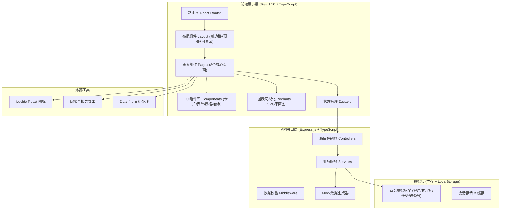
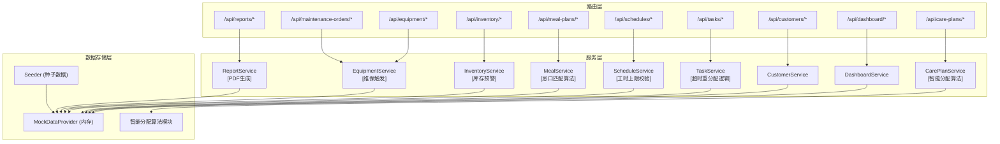
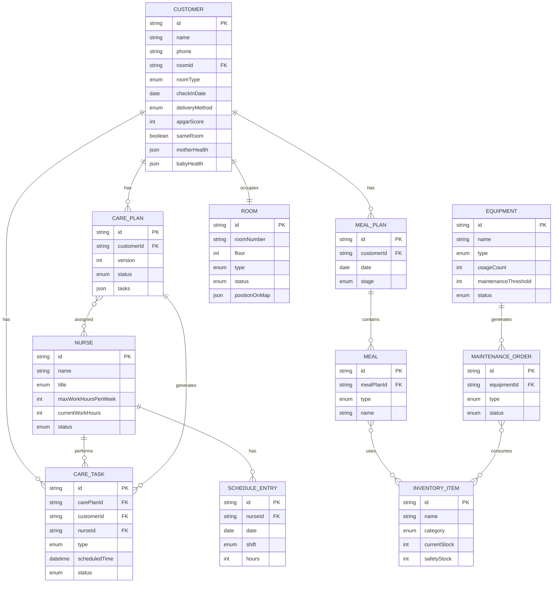

## 1. 架构设计


## 2. 技术描述
- 前端框架：React@18 + TypeScript@5 + React Router@6
- 构建工具：Vite@5
- 样式方案：TailwindCSS@3 + PostCSS
- 状态管理：Zustand@4（轻量，避免Redux冗余）
- UI基础库：Lucide React（图标）+ 自定义组件（不使用AntD/MUI，保持设计独特性）
- 数据可视化：Recharts@2（统计图表）+ 原生SVG（楼层平面图）
- 后端框架：Express@4 + TypeScript
- 数据持久化：前端LocalStorage缓存 + 后端内存数据 + Mock生成器
- PDF导出：jsPDF + html2canvas
- 日期处理：date-fns@3
- 初始化模板：react-express-ts

## 3. 路由定义
| 路由路径 | 页面名称 | 用途 |
|----------|----------|------|
| /dashboard | 运营仪表盘 | 核心KPI、楼层热力图、预警中心 |
| /customers | 客户管理 | 入住登记、客户列表、健康档案 |
| /customers/:id | 客户详情 | 单个客户完整信息与档案 |
| /care-plans | 护理方案管理 | 智能分配、审批工作台、方案列表 |
| /tasks | 任务中心 | Kanban任务看板、状态管理、超时预警 |
| /scheduling | 排班管理 | 周排班日历、工时管理、班次交接 |
| /meals | 营养餐管理 | 配餐日历、食谱配置、库存看板 |
| /equipment | 设备管理 | 设备台账、维保工单、备件库存 |
| /reports | 统计报表 | 入住率/满意度分析、PDF导出 |

## 4. API定义

```typescript
// ========== 类型定义 ==========
export interface Customer {
  id: string;
  name: string;
  phone: string;
  idCard: string;
  roomId: string;
  roomType: 'standard' | 'deluxe' | 'suite' | 'presidential';
  checkInDate: string;
  expectedCheckOutDate: string;
  deliveryMethod: 'natural' | 'cesarean' | 'forceps' | 'vacuum';
  babyGender: 'male' | 'female';
  apgarScore: number; // 1-10
  sameRoom: boolean; // 母婴同室
  motherHealth: MotherHealth;
  babyHealth: BabyHealth;
  dietaryRestrictions: string[];
  carePlanId?: string;
  status: 'checked_in' | 'in_care' | 'checked_out';
  satisfactionScore?: number;
}

export interface MotherHealth {
  bloodPressure: string;
  bloodSugar: number;
  woundRecovery: 'good' | 'normal' | 'poor';
  temperature: number;
  notes: string;
}

export interface BabyHealth {
  weight: number;
  height: number;
  headCircumference: number;
  jaundiceLevel: number;
  feedingType: 'breast' | 'formula' | 'mixed';
  vaccinationRecords: VaccinationRecord[];
  growthHistory: GrowthPoint[];
}

export interface Nurse {
  id: string;
  name: string;
  avatar: string;
  phone: string;
  title: 'junior' | 'senior' | 'supervisor';
  skills: string[];
  maxWorkHoursPerWeek: number;
  currentWorkHours: number;
  status: 'on_duty' | 'off_duty' | 'leave' | 'busy';
  currentLocation?: string; // 房间号
}

export interface CarePlan {
  id: string;
  customerId: string;
  version: number;
  status: 'pending' | 'approved' | 'rejected' | 'adjusting';
  deliveryMethodMatch: string;
  apgarScoreMatch: string;
  sameRoomConfig: string;
  tasks: CareTaskTemplate[];
  assignedNurseIds: string[];
  approverId?: string;
  approveComment?: string;
  createdAt: string;
  approvedAt?: string;
}

export interface CareTask {
  id: string;
  carePlanId: string;
  customerId: string;
  nurseId: string;
  type: 'vital_check' | 'feeding' | 'bathing' | 'wound_care' | 'breast_care' | 'massage' | 'education';
  title: string;
  scheduledTime: string;
  deadline: string;
  status: 'pending' | 'in_progress' | 'completed' | 'timeout' | 'reassigned';
  startedAt?: string;
  completedAt?: string;
  resultNote?: string;
  timeoutHandled?: boolean;
  reassignedFrom?: string;
}

export interface ScheduleEntry {
  id: string;
  nurseId: string;
  date: string;
  shift: 'morning' | 'afternoon' | 'night' | 'day_off';
  assignedRoomIds: string[];
  hours: number;
}

export interface MealPlan {
  id: string;
  customerId: string;
  date: string;
  stage: 'stage1' | 'stage2' | 'stage3'; // 产后阶段
  meals: Meal[];
}

export interface Meal {
  type: 'breakfast' | 'morning_snack' | 'lunch' | 'afternoon_snack' | 'dinner' | 'night_snack';
  name: string;
  ingredients: IngredientItem[];
  tags: string[];
  avoidedIngredients: string[];
}

export interface InventoryItem {
  id: string;
  name: string;
  category: 'food' | 'medical' | 'equipment_part';
  unit: string;
  currentStock: number;
  safetyStock: number;
  lastRestocked: string;
  unitPrice: number;
  supplier: string;
}

export interface Equipment {
  id: string;
  name: string;
  type: 'baby_bed' | 'jaundice_meter' | 'breast_pump' | 'monitor' | 'other';
  serialNumber: string;
  purchaseDate: string;
  usageCount: number;
  maintenanceThreshold: number; // 使用次数阈值
  lastMaintenanceDate?: string;
  status: 'in_use' | 'idle' | 'maintenance' | 'retired';
  currentRoomId?: string;
}

export interface MaintenanceWorkOrder {
  id: string;
  equipmentId: string;
  type: 'preventive' | 'corrective';
  triggerUsageCount?: number;
  status: 'open' | 'in_progress' | 'completed';
  partsUsed: PartUsage[];
  assignedTo: string;
  createdAt: string;
  completedAt?: string;
  notes: string;
}

export interface Room {
  id: string;
  roomNumber: string;
  floor: number;
  type: 'standard' | 'deluxe' | 'suite' | 'presidential';
  status: 'vacant' | 'occupied' | 'cleaning' | 'maintenance';
  customerId?: string;
  bedCount: number;
  area: number;
  dailyRate: number;
  positionOnMap: { x: number; y: number; width: number; height: number };
}

// ========== API 接口定义 ==========

// 仪表盘聚合数据 GET /api/dashboard/overview
interface DashboardOverview {
  occupancyRate: number;
  checkedInCustomers: number;
  todayTasksTotal: number;
  todayTasksCompleted: number;
  todayTasksTimeout: number;
  pendingCarePlans: number;
  lowStockAlerts: number;
  openMaintenanceOrders: number;
  recentNotifications: NotificationItem[];
  occupancyByFloor: { floor: number; occupied: number; total: number }[];
  nurseHeatmapData: { roomId: string; count: number; intensity: number }[];
}

// 客户管理接口
// GET    /api/customers          客户列表（支持分页、筛选）
// POST   /api/customers          创建入住登记
// GET    /api/customers/:id      客户详情
// PUT    /api/customers/:id      更新客户信息
// POST   /api/customers/:id/health-record  新增健康记录

// 护理方案接口
// GET    /api/care-plans              方案列表（按状态筛选）
// POST   /api/care-plans/generate     智能生成方案（传入customerId）
// POST   /api/care-plans/:id/approve  审批通过
// POST   /api/care-plans/:id/reject   审批驳回
// POST   /api/care-plans/:id/adjust   申请调整
// POST   /api/care-plans/:id/confirm  护理师确认

// 任务接口
// GET    /api/tasks                  任务列表（支持按日期/护理师/状态筛选）
// PATCH  /api/tasks/:id/status       更新任务状态
// POST   /api/tasks/:id/reassign     重新分配任务
// GET    /api/tasks/timeout-alerts   获取超时预警列表

// 排班接口
// GET    /api/schedules?weekStart=YYYY-MM-DD  获取周排班
// POST   /api/schedules                        批量设置排班
// GET    /api/nurses                           护理师列表（含工时统计）

// 营养餐接口
// GET    /api/meal-plans?weekStart=xxx         获取周配餐
// POST   /api/meal-plans/generate              自动生成配餐
// GET    /api/inventory?category=food          库存列表
// POST   /api/inventory/:id/restock            补货
// GET    /api/inventory/alerts                 低库存预警

// 设备接口
// GET    /api/equipment                        设备台账
// POST   /api/equipment/:id/increment-usage    使用次数+1（触发维保检查）
// GET    /api/maintenance-orders               维保工单列表
// POST   /api/maintenance-orders/:id/complete  完成工单

// 统计报表接口
// GET    /api/reports/occupancy?period=month&start=xxx&end=xxx
// GET    /api/reports/satisfaction?start=xxx&end=xxx
// GET    /api/reports/room-type-breakdown
// POST   /api/reports/export-pdf  生成并返回PDF buffer

// 楼层接口
// GET    /api/rooms                    所有房间（含位置信息）
// GET    /api/floors/heatmap?floor=3   楼层热力数据
```

## 5. 服务端架构图


## 6. 数据模型

### 6.1 ER图


### 6.2 智能分配算法核心逻辑说明
```
输入：
  - customer.deliveryMethod (分娩方式)
  - customer.apgarScore (新生儿评分)
  - customer.sameRoom (是否同室)
  - nurses[] (护理师列表，含当前工时)
  - maxWeeklyHours (周工时上限)

规则：
1. 若剖宫产(cesarean) + 评分<7 → 优先高级护理师 + 频次加倍
2. 若顺产 + 评分≥8 → 可分配初级护理师
3. 母婴同室 → 需额外分配夜间班次护理师
4. 工时排序：优先分配 currentWorkHours/max 比值最低者
5. 技能匹配：伤口护理资质 ↔ 剖宫产客户

输出：
  - CarePlan（含任务模板）
  - assignedNurseIds[]
```
